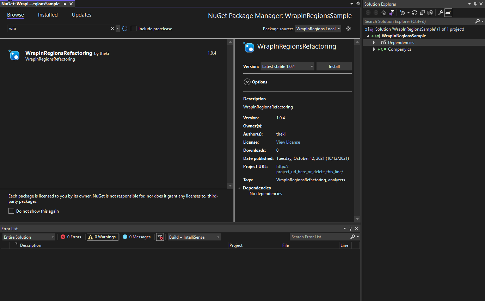

### Premise
For legacy projects utilizing regions instead of properly structuring types.

You may want to disable StyleCop rule SA1124 (DoNotUseRegions).

### Features
* Warns about the absence of any regions in a class declaration
* Provides a CodeFix for introducing regions in a class

### Installation
**Bound to project**
This method uses NuGet packages for easy installation. This will work for any .NET-capable IDE.
1. Deploy NuGet package to your private NuGet source
2. Install package to your projects

**Bound to Visual Studio**
If you only use Visual Studio you can install to VSIX extension. This will make the Analyzer/CodeFix 
available for any project as long as you use Visual Studio. 
